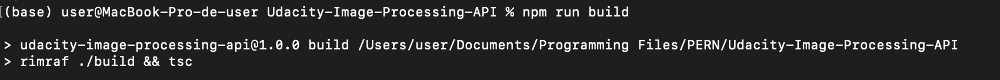
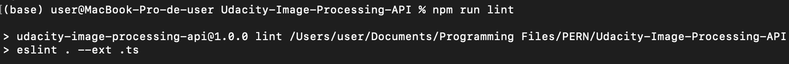
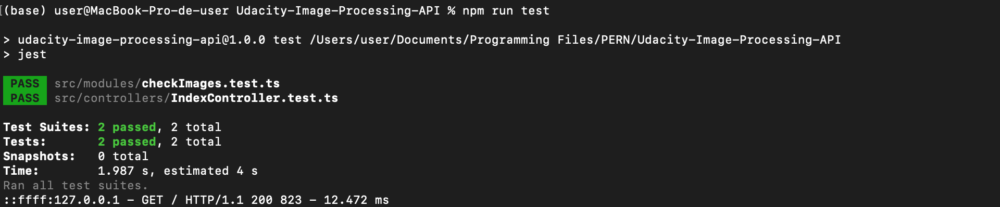
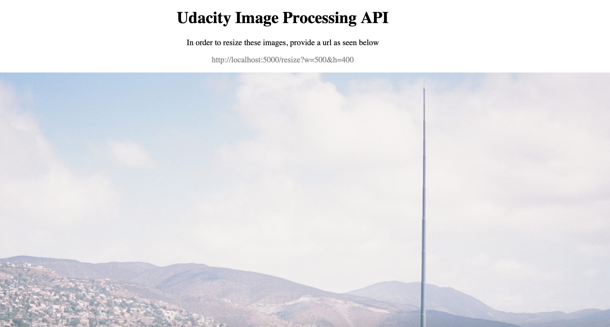
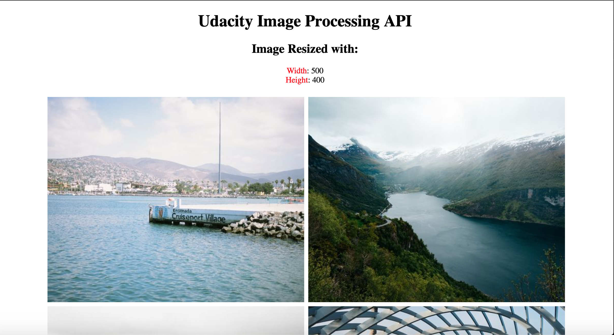
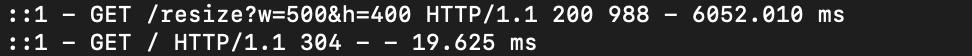
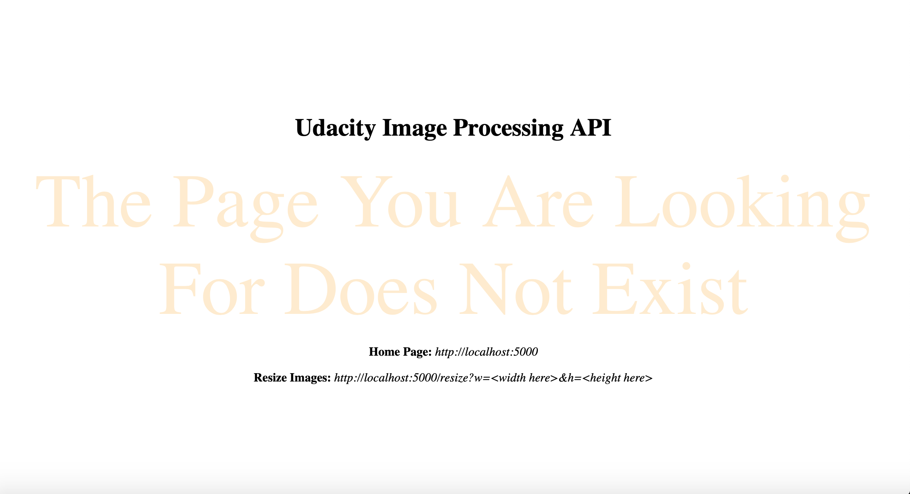
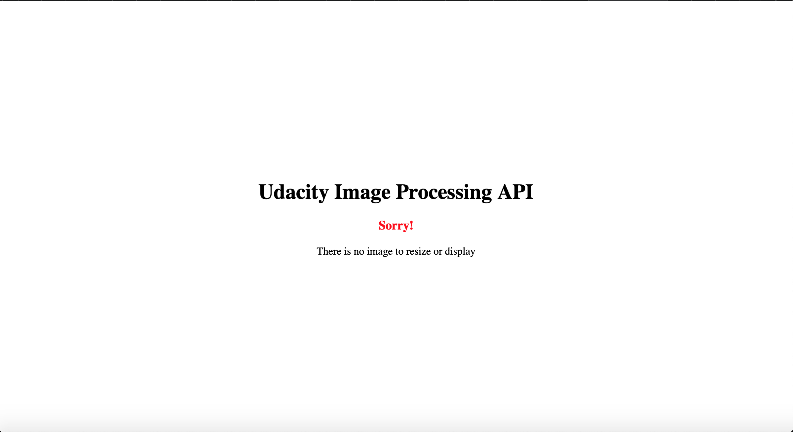
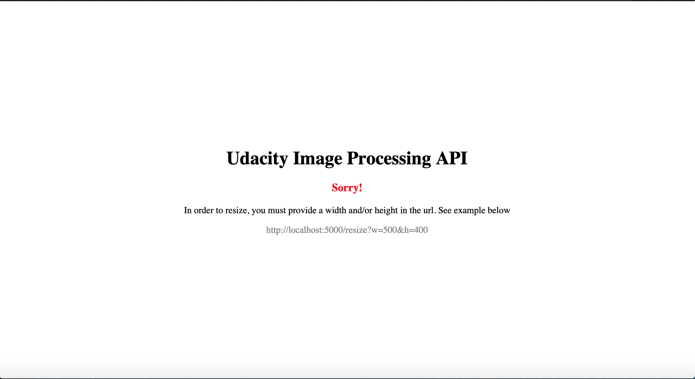

# Udacity-Image-Processing-API


## Overview
This is an API that can be used in two different ways. The first, as a simple placeholder API that allows us to place images into our frontend with the size set via url parameters. The second use case is as a library to serve properly scaled versions of our images to the frontend to reduce page load size. 

## Requirement
Here, I will list all the dependencies used in this project and how to install them.

#### 1. TypeScript
`npm i -D typescript ts-node`

#### 2. express and type express(Typescript support for express)
```
npm i -S express
npm i -D @types/express
```

#### 3. nodemon
`npm i -D nodemon`

#### 4. rimraf
`npm install --save-dev rimraf`

#### 5. eslint
`npx eslint --init`

#### 6. prettier 
`npm install --save-dev prettier`

#### 7. set up prettier and eslint
`npm install --save-dev eslint-config-prettier eslint-plugin-prettier`

#### 8. Jest with type definition and typescript jest runner
`npm i -D jest @types/jest ts-jest`

#### 9. SuperTest with type definition
`npm i -D supertest @types/supertest`

#### 10. morgan and types
`npm i -P morgan @types/morgan`

#### 11. sharp and types
`npm i -P sharp @types/sharp`

#### 12. ejs
`npm install ejs --save`

## How to build and start the server
The project can be built and run in the following ways
### 1. Build
`npm run build`


This command will build the typeScript code into JavaScript and save them in the `./build` folder.

### 2. Start the Server
`npm start`

This command will start the server running on port `5000`. And the front end homepage will be accessible at `http://localhost:5000`

## Testing and Linting
Here, I will show you how to run the test and also how to check that our code respects all the eslint rules.

### 1. Linting
`npm run lint`


### 2. Testing
`npm run test`




## Endpoints and Functionality. 
This project defines two endpoint. 

### 1. Homepage endpoint
`http://localhost:5000`



This endpoint is used to access all images with their original sizes. We will notice that the images displayed on this frontend are very large since we are trying to display the images with their original sizes,


### 2. Resize endpoint
`http://localhost:5000/resize?w=<width>&h=<height>`

Using the endpoint above, we can provide our width and height value that we want our images to be resized. Check the example below

`http://localhost:5000/resize?w=500&h=400`



This endpoint is used to resize all images found in the `public/images/full` directory and saving them in the `public/images/thumbnails` directory. Then, it will serve these images to the frontend to be viewed. 

If a dimension is given that has all images already resized to that dimension, no futher resizing will take place. Instead, the already resized images with the appropriate dimensions will be pushed to the frontend. 

**NB**: This process takes some few seconds to resize all images in that directory. The more the images, the more time it can take. 

## Middlewwares to be aware of
I included two middlewares in this project. 
### 1. Logger Middleware 
This is for development purposes. It logs  information about the endpoints that is been accessed to the console. 

The images below shows the logger output for accessing both the resize and home page endpoint



### 2. Page Not Found Middleware
This endpoint handles any unknown endpoints. For now, only two endpoints are recognized

```
http://localhost:5000/resize
http://localhost:5000/
```

If you try to access an enpoint order than these, this moddleware will redirect to a page not found as seen below




## Handling Other Uncertainties
This API handles situations where there are no images to resize or parameters are not provided to resize the images.

### 1. No images to resize



This API uses the directory `./public/images/full` to get images when resizing. If no images are found in this directory and the corresponding resized images can't be found in the `./public/images/thumbnails` directory, then a warning message will be shown on the frontend as seen above.

### 2. No Parameter is provided 



If we are accessing the resizing endpoint, we should also provide the dimension that will be used to resize the images. If no parameter is provided, a warning message will be shown on the frontend as seen above

NB: At least one parameter should be provided. We may decided to resize only the width or the height. 

## Resources
- [Jest doc](https://jest-bot.github.io/jest/docs/getting-started.html)
- [TypeScript doc](https://www.typescriptlang.org)
- [Resizing Images with Sharp](https://sharp.pixelplumbing.com/api-resize)
- [Fastest way to copy a file in Node.js](https://stackoverflow.com/questions/11293857/fastest-way-to-copy-a-file-in-node-js)
- [Prettire format options](https://prettier.io/docs/en/options.html)